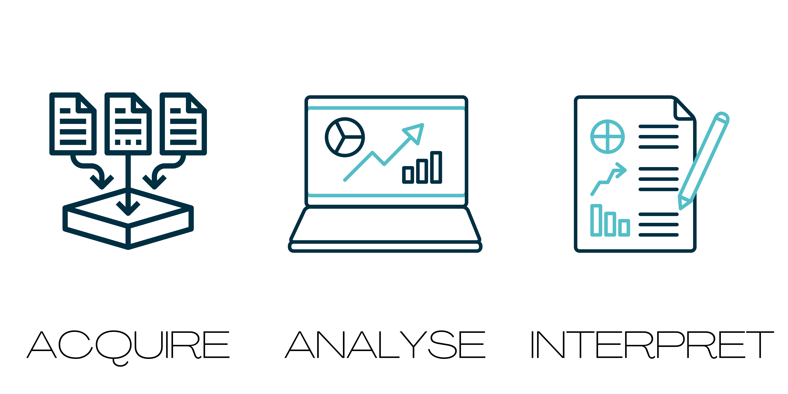

# Course in Data Science for Manufacturing

The [University of Edinburgh](https://www.ed.ac.uk) is hosting, a university-certified, _10-credit_, online course in data science for manufacturing with flexible schedule. The course runs in 2023 from __January 27th - March 31st (10 weeks)__ and is dedicated to professionals in---among others---the manufacturing sector.

Assuming students are familiar with the processes commonly used to organise and undertake engineering manufacture this online course teaches:

*	What types of data can be found in manufacturing
*	How manufacturing data can be accessed, aggregated and analysed 
*	How the data can be used to optimize processes
*	Particular topics
    -   Python Coding and Notebook Programming Environments 
    -   Data Carpentry
    -   Data Visualization
    -   Relational and Graph Data Structures
    -   Forms of manufacturing data(e.g. Supply Chain (Supply Chain, ERP, PLM, CAD/CAM)
    -   Machine learning/Data analysis

It covers the fundamentals of: 
* Exploratory data analysis
* The importance of data science in manufacturing
* Tools for data analysis
* Tools and techniques for data visualisation and evaluation
* __Introduce__ you to the ramifications of data collection and use in a manufacturing setting
* __Introduce__ you to __programming__ with Python, version control with Git and Github and other key software practices.
* Develop an __understanding__ of data formats, their wrangling and management, including CSV and relational databases (SQL), CAD formats and materials 
* __Develop__ skills in the analysis and visualisation of a range of data using descriptive statistics and exploratory data analysis
* __Criticise__ data use and practises 
* __Introduce__ collaborative practices around data collection, analysis and presentation

Meet the organizers and join our **[open info session on MS Teams](https://teams.microsoft.com/l/meetup-join/19%3ameeting_NGNiMDI2ZTQtNmY4MS00MTMwLTk2NzUtN2RhMzllN2QwMzY2%40thread.v2/0?context=%7b%22Tid%22%3a%222e9f06b0-1669-4589-8789-10a06934dc61%22%2c%22Oid%22%3a%2269a6ec46-60d9-4c4e-99e5-c8561f10dbfb%22%7d)** (installed MS Teams application required). The session gives an overview over the course and the chance for prospective students to ask questions about the content and delivery of the course. Sessions times are 
* Thursday, Jan 12th, 6-7pm, BST

With an aim to build skills that allow participants to directly apply their learning, the course features __online videos and reading material__, __tutorial workshops__, __drop-in sessions__,  __complementary online teaching material__, and __seminars by guest speakers__. More about the [course organisation](organisation.html) and its [schedule](content.html).

<!---We encourage **BYOD---bring and work on your own data project** (we can sign non-disclosure agreements). --->
Class examples will include open-access data on a variety of relevant issues such as [Supply Chain Datasets](https://www.kaggle.com/abdelrahmancae/supply-chain-analysis-and-modeling), [Process Monitoring](https://towardsdatascience.com/manufacturing-data-analytics-with-python-a-hands-on-example-6de8817a24dc) and [Process Optimisation](https://towardsdatascience.com/how-to-use-data-science-in-industrial-production-environments-6accf24afeb2).

### Learning Outcomes
1. **Understand** : Have knowledge of the data ecosystem of manufacturing companies
2. **Program** : Identify and deploy strategies for writing, understanding and managing computer programs using Python and version control.
3. **Data** : The ability to wrangle, analyse, learn from and visualise a range of data, in a way that demonstrates its relevance to digital manufacturing.
4. **Evaluation** : Critically reflect on the results and suggest constructive solutions. 
5. **Communicate** : Communicate around manufacture relevant issues, supported by the use of multiple data sources and appropriate analysis.
6. **Apply** : Competently apply data science techniques and tools.
7. **Professionalism** : Working in collaborative, interdisciplinary teams to a high professional standard.

### Takeaways 
* A **certificate** to reflect a 10 credit-bearing course at Masters level (SCQF Level 11)
* **Visual representation** of your dataset that enables you to answer the challenge you defined around it before and during the course.
* **Skills** to use data science effectively on manufacture related problems.
* **Communicate** your findings effectively. 

Browse further detail on the __[course structure](organisation.md)__.

<!-- ## Focus Groups -->

## [Submit Application](https://forms.office.com/pages/responsepage.aspx?id=sAafLmkWiUWHiRCgaTTcYSh2MWKVoxpLrG5A3l7A6AdUNzFSMlNFVDVZOUdBNzNMNUU0QTEzTDRYRy4u)

<!-- Applications are now being accepted for the course. Please note that you **must** state that you are registering for the course ***Data Science for Manufacturing*** in the "Supporting Statement" section of the [application form](https://www.ed.ac.uk/studying/postgraduate/degrees/index.php?r=site/view&edition=2020&id=1002). -->

## Course Delivery Information
* Start Date: __27 January 2023__
* Course Duration: __10 weeks__, complementing self-directed online and on site learning with one hands-on session per week via a virtual classroom, in addition to a Q&amp;A session to discuss lectures and corresponding exercises 
* Total Hours: __50-100hrs__ (Lecture Hours 9; Workshop tutorial Hours 18; Independent Study Hours 30-73) 
* Weekly investment: __5-10hrs__, including lectures, workshop tutorials, reading, Q&As, project work.
* Weekly lectures will take place on __Fridays, 9am – 10am__ followed by a computer-based workshop __10am to 12noon__. There will be a drop-in clinic when needed on __Thursdays, 7pm – 8pm__.  
* Method of Assessment: __Coursework 100%__, including submission of a final project based on an industrial dataset (which optionally can be related to the current employer of students, NDAs could be signed).  
* Assessment information: Written Exam 0%, Coursework 100%, Practical Exam 0%. Weekly check-ins of the proposed project in the clinics. You will receive one-on-one and detailed written feedback on your project.
